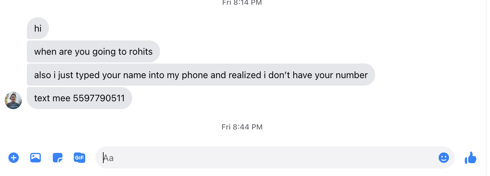
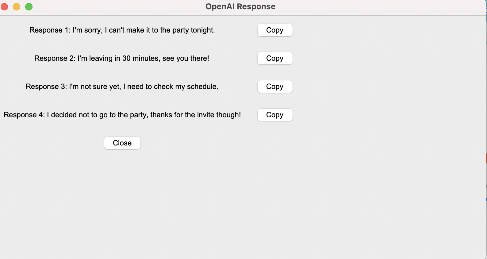

# DoubleShift :fast_forward:

Communication takes time. :clock1:

Responding to lengthy recruiting emails, texting your friends dinner plans, messaging your boss what you did this week all take **time**. :alarm_clock:  

Don't you wish there was a **fast** way that you could respond to all these communication channels **effectively** and **efficiently**? :pray:

Well look no further, ***DoubleShift*** is here!  :raised_hands:

By running the double_shift module with the command: `python3 double_shift.py` and then typing `shift shift` in **any** situation you want to reply **quickly** to :fast_forward:;

You can generate a response to any conversation on your *current* screen in a **variety** of ways in a matter of **seconds** :running:. 

# Demo :astonished:

Let's say your friend asks you a when ya heading out question like this :question:: 

You can run `shift shift` and get the following response in a matter of seconds :star:. 

With a quick `copy` and `paste` you can respond faster than you would have originally saving you time and money! Yay :smile:

# Known Issues To MVP (Goal: Tuesday)
- [ ] Tkinter does not work while running in a thread sad. Need to fix (2 hour)
- [ ]  OCR pytesseract quality is really low. Need to either filter text through prompt enginering or find a way to extract better OCR to text from huggingface (layoutvm3) (2 hours)

# Extensions (Goal: Thursday)
- [ ] Autorun pipeline of extracted text on all emails. Find easy way to hook up emails. Keep the good responses and paste to screen. (2 hour)
- [ ] Stretch goal: Make UI Better by switching from tkinter to something that can autofill in your screen (3 hours) 

# Presentation (Friday): 
- [ ] Make cute sales slides and 1 cute demo of fb message response and 1 walkthrough of gmail response. 1 minute long max (2 hour)

  
